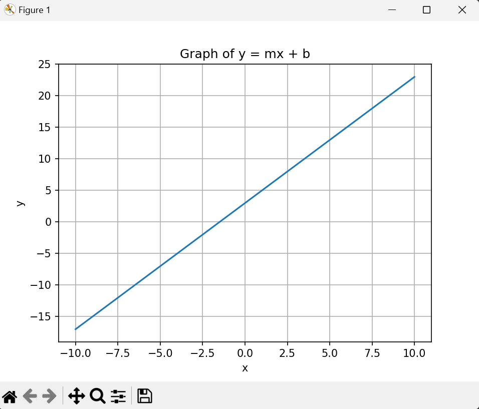

# Getting started from scratch

1. Install Python 3.6 or later from [python.org](https://www.python.org/downloads/).
    > used 3.12.2 for this content

1. Open VS Code
1. Install the python extension
1. Use the VS Code command palette to create a new `venv` environment
1. Create a python terminal using the command palette
1. Use the following code to activate the environment

    ```pwsh
    .venv\Scripts\activate
    ```

1. Use the following code to install the required packages

    ```pwsh
    pip install numpy matplotlib
    ```

1. Freeze the packages to a `requirements.txt` file

    ```pwsh
    pip freeze > requirements.txt
    ```

    > Restoring on a new machine can now be performed by running `pip install -r requirements.txt`


1. Paste the following code into a new file named `main.py`

    ```python
    import numpy as np

    import matplotlib.pyplot as plt

    def draw_graph(m, b):
        x = np.linspace(-10, 10, 100)
        y = m * x + b

        plt.plot(x, y)
        plt.xlabel('x')
        plt.ylabel('y')
        plt.title('Graph of y = mx + b')
        plt.grid(True)
        plt.show()

    # Example usage
    m = 2
    b = 3
    draw_graph(m, b)
    ```

1. Run the code using the following command

1. The output should look like

    


# Install CUDA
1. https://developer.nvidia.com/cuda-downloads

1. Validate by running the following command
    ```
    nvcc --version
    ```

# Install Torch
1. https://pytorch.org/get-started/locally/
1. Select the appropriate options for your system
    ```
    pip3 install torch torchvision torchaudio --index-url https://download.pytorch.org/whl/cu121
    ```

1. Validate by changing `main.py`
    ```
    import torch

    print(torch.cuda.is_available())
    exit()
    ```

# Install the build tools
1. Install the build tools from the following link to support `flash-attn`
    1. https://visualstudio.microsoft.com/visual-cpp-build-tools/